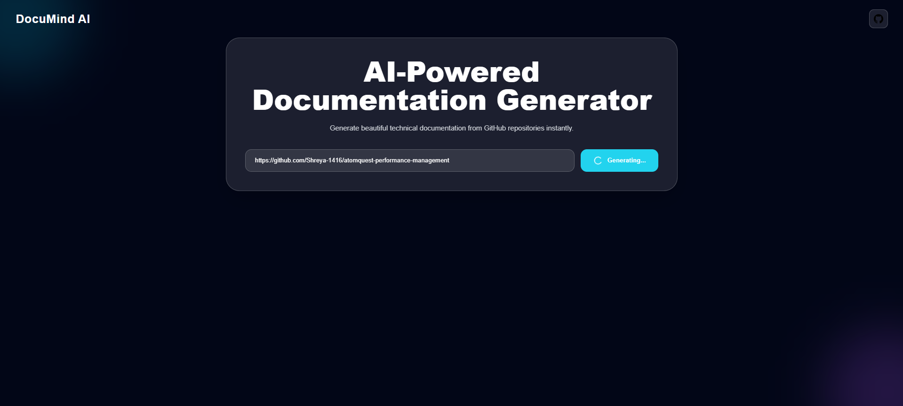
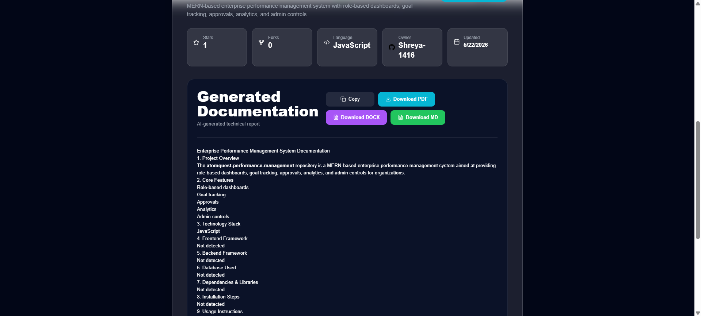
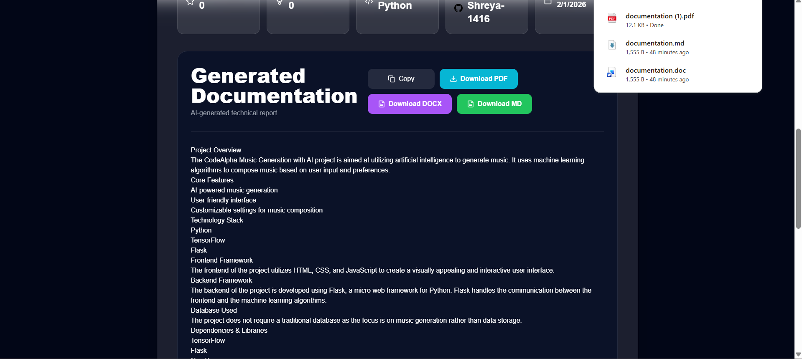
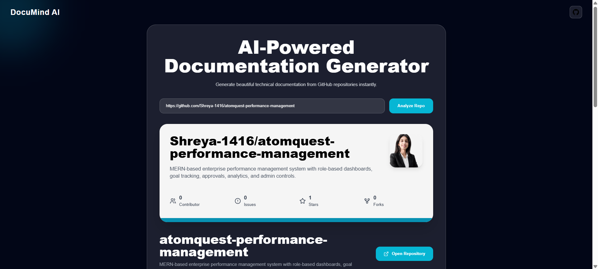

# DocuMind AI

AI-powered GitHub Documentation Generator that transforms GitHub repositories into professional technical documentation instantly using OpenRouter AI.

Built for developers, teams, students, and hackathons to automate project documentation workflows efficiently.

---

# Features

- AI Documentation Generation
- GitHub Repository Analysis
- Repository Statistics
- Professional PDF Export
- DOCX Export
- Markdown Export
- Responsive Modern UI
- GitHub API Integration
- OpenRouter AI Integration
- Repository Preview System
- Live Repository Insights
- Multi-format Documentation Download

---

# Tech Stack

## Frontend
- React.js
- Tailwind CSS
- Axios
- React Markdown
- jsPDF

## Backend
- Node.js
- Express.js
- OpenRouter API
- GitHub REST API

---

# Live Demo

## Frontend
https://YOUR-VERCEL-LINK.vercel.app

## Backend
https://document-ai-backend-s6ee.onrender.com

---

# Architecture

User → React Frontend → Express Backend → OpenRouter AI → Generated Documentation

GitHub Repository → GitHub API → Repository Analysis → AI Processing

---

# Installation

## Clone Repository

```bash
https://github.com/Shreya-1416/document-ai
```

---

## Frontend Setup

```bash
cd client
npm install
npm run dev
```

---

## Backend Setup

```bash
cd server
npm install
npm start
```

---

# Environment Variables

Create `.env` file inside the `server` folder.

```env
OPENROUTER_API_KEY=your_openrouter_api_key
```

---

# How It Works

1. User pastes GitHub repository URL
2. GitHub API fetches repository information
3. Backend analyzes repository metadata
4. OpenRouter AI generates professional technical documentation
5. User downloads documentation in multiple formats:
   - PDF
   - DOCX
   - Markdown

---

# Screenshots

## Home Page



---

## Documentation Generation



---

## PDF Export



---

## Repository Analysis



---

# Future Improvements

- Authentication System
- Documentation History
- Multi-language Support
- Architecture Diagram Generator
- AI Code Review
- README Quality Analyzer
- Team Collaboration Features
- Cloud Storage Integration

---

# Deployment

## Frontend Deployment
- Vercel

## Backend Deployment
- Render

---

# API Flow

GitHub Repository URL  
↓  
GitHub API Analysis  
↓  
Backend Processing  
↓  
OpenRouter AI Documentation Generation  
↓  
Export to PDF / DOCX / Markdown

---

# Contribution Guide

1. Fork the repository
2. Create a new feature branch
3. Commit your changes
4. Push to your branch
5. Open a Pull Request

---

# License

This project is licensed under the MIT License.

---

# Author

Developed by Shreya Gupta